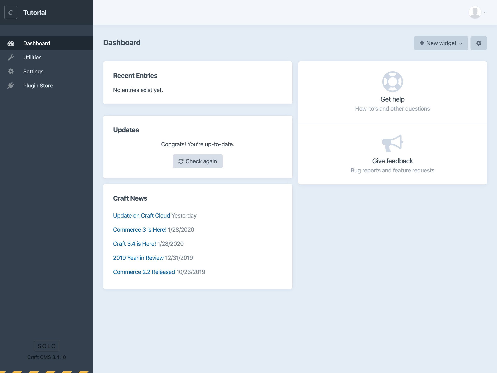
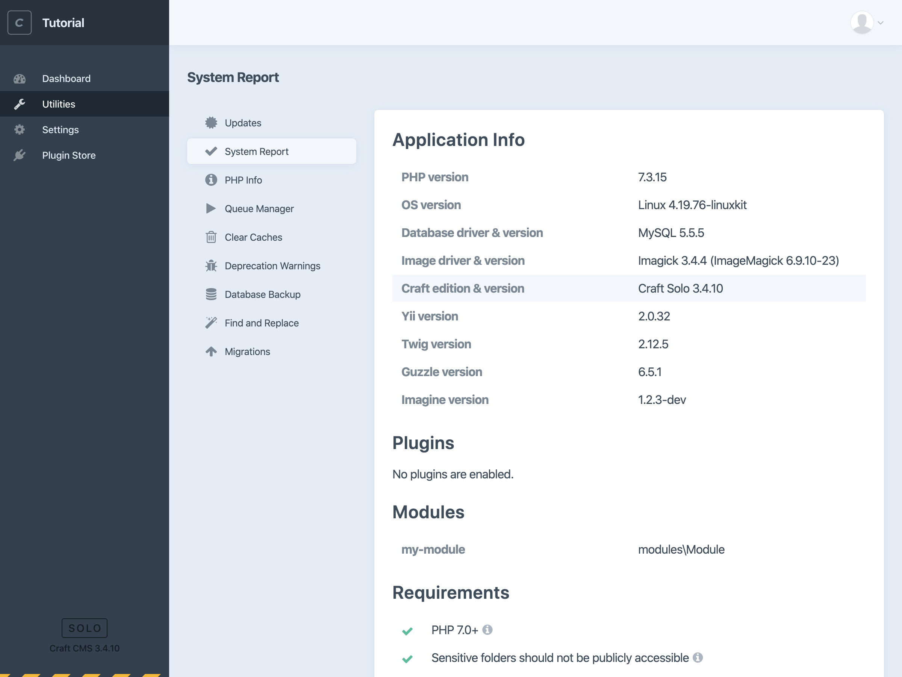

# 2. Configure & Create Your Content

You now officially have a working local Craft CMS install!

In this section we’ll learn what to do with it:

1. Take quick tour of the control panel.
2. Configure and edit our blog content.
3. Build dynamic front end templates or work with the GraphQL API.

## Control panel tour

The control panel may seem a bit empty—that’s a feature, not bug! Craft doesn’t tell you how to structure your content, it provides a blank slate you can use to build with however you’d like.

Let’s take a quick tour of the control panel to get oriented.

<BrowserShot url="https://localhost:8080/admin/dashboard" :link="false">

</BrowserShot>

The place you landed is the Dashboard, which you can customize with various widgets. By default, we’ll see the Recent Entries we haven’t created yet, recent Craft News, a Support and Feedback options, and a notice about whether any software updates are available.

In the upper right corner you can choose the profile circle to edit your account details or log out.

In the opposite lower left corner, you’ll see your Craft edition (Solo) and current version number. If you’re the explore-ahead type, you can click that edition badge to switch to a trial of Craft Pro. It doesn’t expire and it won’t hurt anything, but that’s not what we’re doing right now.

To the left, then, is the sidebar navigation. (You may have to use the hamburger icon to expand the navigation if you’re working with a narrow-ish browser window.) Choose Utilities.

<BrowserShot url="https://localhost:8080/admin/utilities/system-report" :link="false">

</BrowserShot>

You probably won’t need to visit Utilies too often, but it has some helpful tools.

By default you’ll land on the System Report. These are key details about your Craft install, and while we’re here it’s a good idea to make sure that each of the items under “Requirements” has a green check mark next to it. If anything there does not have a green check mark, choose the “i” icon to see more information and see if it’s something you’re able to adjust and meet that requirement.

We won’t be using these utilities so you can skip ahead if you’d rather. But here’s a quick look at what they do:

- **Updates** will list software updates that are available for Craft CMS and any installed plugins.
- **PHP Info** lists exhaustive details about your environment’s PHP configuration that can be useful for troubleshooting.
- The **Queue Manager** lets you peek under the hood of the system Craft uses to run batches of small jobs. Things will show up and disappear themselves as jobs are queued up and completed.
- **Clear Caches** lets you select and clear types of temporary stored data Craft uses to stay fast.
- **Deprecation Warnings** will detail any outdated code you might be using, where to find it, and usually what to replace it with.
- **Database Backup** lets you easily make and optionally download a copy of your database.
- **Find and Replace** is a powerful tool you can use to find and replace text in your database.
- **Migrations** will list and run PHP instructions you write for programmatically changing stuff.

## Plugin Store

Craft’s built-in plugin store makes it easy to use free and paid plugins to add functionality to your Craft CMS website.

## Content in Craft CMS

The process of deciding what shape your content should take is referred to as “content modeling.” Once you’re familiar with Craft’s building blocks, it can be liberating and even fun to decide how you’ll use them to bring your project to life.

### Get familiar with content modeling in Craft

Let’s take a quick look at the key building blocks and then use them to set up our blog.

#### Sections & Entries

Sections are often where most of your content will live. A section is a collection of similar types of content, like a blog post, press release, or job listing. Each section is meant to have many Entries that each follow a specific URL pattern and use whatever set of custom input fields you decide it should have.

A job listing section, for example, might have fields for requirements, location and salary range. A blog post probably won’t need any of those, but certainly a post body, imagery, and categories or tags.

#### Structures

A normal Section will have Entries that are ordered by date. A Structure is a special kind of Section where Entries can be dragged and dropped into a fixed hierarchy that’s more useful for products and services, case studies, or content that’s meant to be presented in a very specific way.

#### Singles

Singles are for one-off pages. Technically Singles are a type of Section that only has one page. These can be useful for something like your About page, which won’t have multiple Entries but may still require its own Field Layout.

#### Entry Types

Craft uses the term Entry Type to define the set of input fields that belongs to a Section. Every Section has at least one Entry Type or set of fields. You can, however, add as many Entry Types as you’d like for each Section. This isn’t common, but it can be useful when your content may regularly take one of several forms. A job posting, for example, might typically be related to a specific office location in a _Local_ Entry Type, but also sometimes need to be a remote position (_Remote_ Entry Type) related to a specific timezone or set of countries.

#### Fields

Each Entry Type is made up of whatever Fields you decide to add.

By default, every Entry will have a Title, Post Date, Expiration Date, and a Slug if its Section has public URLs.

You’ll use Field Layouts to add and arrange as many Field Types as you need, in any number of tabs. Craft comes with powerful Field Types out of the box:

- Assets
- Categories
- Checkboxes
- Colors
- Date/Time
- Dropdown
- Email
- Entries
- Lightswitch
- Matrix
- Multi-select
- Number
- Plain Text
- Radio Buttons
- Table
- Tags
- URL
- Users

TODO: add grid of screenshots/examples for each field type? (show how they can be used)

More field types are available from third parties on the plugin store.

#### Globals

Sometimes you’ll need to manage content that isn’t used on any single page, but shared by one or more pages on your site. This is what Globals are for. Globals are groupings of field sets, similar to Entry Types, that can be accessed globally, or throughout your site’s code. Common examples of globals might be a company name and address, office hours, or social media profile links.

#### Assets

Assets are files that are managed by Craft CMS. They’re stored in Asset Volumes, which you can think of like folders, and each Asset Volume can have its own Field Layout just like an Entry.

Craft CMS includes powerful tools for editing images and setting their focal points right in your browser, along with convenient tools for dynamically cropping and sizing them in your templates.

## Building a blog

Let’s start setting up our blog using these pieces.

### Create a blog section

The first thing we’ll do is create a new Section for our blog posts.

- TODO: create Blog section

### Create blog fields

Next, let’s create fields we can make available for our blog posts.

- TODO: create fields
  - Matrix: body + images
  - Assets: feature image
  - Categories
  - Plain Text: short description
- TODO: establish Entry Type

### Configure Globals

- TODO: add Global Set

### Create an About page

- TODO: create Single

### Edit entries

TODO: edit blog entries

TODO: integrate a Structure?
